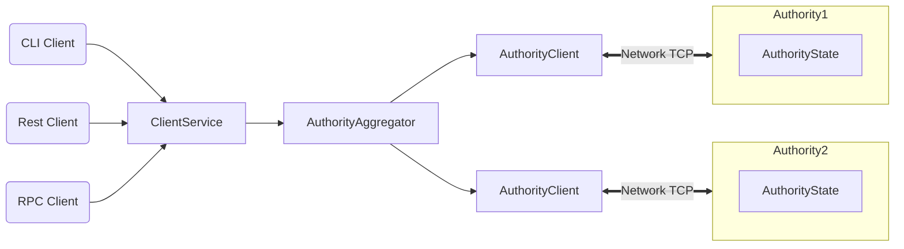

# Welcome to MySocial

[MySocial](https://mysocial.network) is a high-performance blockchain purpose-built for social networks, digital expression, and on-chain commerce. It provides the foundational infrastructure for a global social economy where users, creators, and communities can interact, transact, and coordinate without centralized gatekeepers.

MySocial is designed to support equal opportunity for expression and participation, enabling ideas, content, and value to move freely at internet scale. The system is vertically integrated for social use cases and horizontally scalable to support massive global adoption.

## MySocial Highlights

MySocial offers the following capabilities:

 * Internet-scale throughput with low and predictable latency
 * Parallelized execution optimized for social and economic activity
 * Asset-oriented smart contracts designed for user-owned data and value
 * A developer-friendly programming model using Move
 * Infrastructure designed for social graphs, media, identity, and commerce

MySocial is the only blockchain today that can scale with the growth of web3 while achieving industry-leading performance, cost, programmability, and usability. As MySocial approaches Mainnet launch, it will demonstrate capacity beyond the transaction processing capabilities of established systems – traditional and blockchain alike. MySocial is the first internet-scale social economy, a foundational layer for web3.

## MySocial Architecture

## MySocial Overview

MySocial is a permissionless blockchain maintained by a decentralized set of authorities responsible for transaction execution and system integrity, similar to validators in other blockchain systems.

Unlike traditional blockchains optimized primarily for financial settlement, MySocial is optimized for social-scale activity. The majority of transactions are processed in parallel, allowing the system to efficiently handle high-volume interactions such as posting, liking, tipping, trading, and media-related operations. Through this design, MySocial achieves low latency while maintaining strong security guarantees.

For common social and economic interactions, MySocial avoids unnecessary global consensus overhead and instead relies on simpler, lower-latency primitives. This enables entirely new classes of latency-sensitive applications, including social feeds, creator marketplaces, real-time messaging, and interactive media experiences.

MySocial is written in [Rust](https://www.rust-lang.org) and supports smart contracts written in the [Move programming language](https://github.com/move-language/move) to define assets that may have an owner. Move programs define operations on these assets including custom rules for their creation, the transfer of these assets to new owners, and operations that mutate assets.

MySocial has a native token called MySo, with a fixed supply of 1 billion. The MySo token is used to pay for gas, and is also used as [delegated stake on authorities](https://learn.bybit.com/blockchain/delegated-proof-of-stake-dpos/) within an epoch. The voting power of authorities within this epoch is a function of this delegated stake. Authorities are periodically reconfigured according to the stake delegated to them. In any epoch, the set of authorities is [Byzantine fault tolerant](https://pmg.csail.mit.edu/papers/osdi99.pdf). At the end of the epoch, fees collected through all transactions processed are distributed to authorities according to their contribution to the operation of the system. Authorities can in turn share some of the fees as rewards to users that delegated stakes to them.

## More About MySocial

Use the following links to learn more about the Social Proof Foundation and the MySocial ecosystem:

 * Learn more about working with MySocial in the [MySocial Documentation](https://docs.mysocial.network/).
 * Join the MySocial community on [MySocial Telegram](https://t.me/mysocial_chain).
 * Review information about MySocial governance, [decentralization](https://docs.mysocial.network/mysocial/getting-started/decentralization).

 ## How to Contribute

 See the [Contributing Guide](CONTRIBUTING.md) for details on how to contribute to MySocial.

 ## Code of Conduct

 See the [Code of Conduct](CODE_OF_CONDUCT.MD) for details on our code of conduct.

 ## License

 See the [LICENSE](LICENSE) file for more details.
