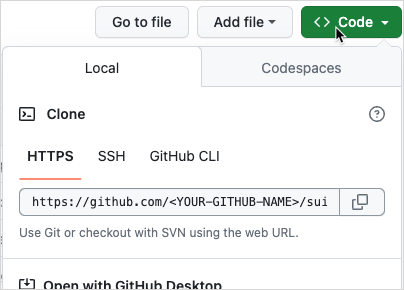

Before you start developing with MySocial and Move, you should familiarize yourself with how to contribute to MySocial, how MySocial is structured, what tools and SDKs exist, and what plugins are available to use in your IDE.

## Fork the MySocial repository {#fork}

The recommended way to contribute to the MySocial repository is to fork the project, make changes on your fork, then submit a pull request (PR). The MySocial repository is available on GitHub: https://github.com/MystenLabs/mys.

To create a local MySocial repository:

1. Go to the [MySocial repository](https://github.com/MystenLabs/mys) on GitHub.
1. Click the **Fork** button to create a copy of the repository in your account.

   

1. In your forked repository on GitHub, click the green `Code <>` button and copy the **HTTPS** URL GitHub provides.

   

1. Open a terminal or console on your system at the location you want to save the repository locally. Type `git clone ` and paste the URL you copied in the previous step and press `Enter`.
1. Type `cd mys` to make `mys` the active directory.

You can use any [branching strategy](https://docs.github.com/en/pull-requests/collaborating-with-pull-requests/proposing-changes-to-your-work-with-pull-requests/creating-and-deleting-branches-within-your-repository) you prefer on your MySocial fork. Make your changes locally and push to your repository, submitting PRs to the official MySocial repository from your fork as needed.

:::tip

Be sure to synchronize your fork frequently to keep it up-to-date with active development.

:::

## MySocial repository and how to contribute

The MySocial repo is a monorepo, containing all the source code that is used to build and run the MySocial network, as well as this documentation.

The root folder of the MySocial monorepo has the following top-level folders:

- [apps](https://github.com/MystenLabs/mys/tree/main/apps): Contains the source code for the main web applications that Mysten Labs runs, `MySocial Wallet`.
- [consensus](https://github.com/MystenLabs/mys/tree/main/consensus): Contains the source code of consensus.
- [crates](https://github.com/MystenLabs/mys/tree/main/crates): Contains all the Rust crates that are part of the MySocial system.
- [dapps](https://github.com/MystenLabs/mys/tree/main/dapps): Contains some examples of decentralized applications built on top of MySocial, such as Kiosk or Sponsored Transactions.
- [dashboards](https://github.com/MystenLabs/mys/tree/main/dashboards): Currently empty.
- [doc](https://github.com/MystenLabs/mys/tree/main/doc): Contains deprecated documentation related to Move and MySocial.
- [docker](https://github.com/MystenLabs/mys/tree/main/docker): Contains the docker files needed to spin up a node, an indexer, a Full node or other services.
- [docs](https://github.com/MystenLabs/mys/tree/main/docs): Contains this documentation and the source for this site.
- [examples](https://github.com/MystenLabs/mys/tree/main/examples): Contains examples of apps written for MySocial and smart contracts written in Move.
- [external-crates](https://github.com/MystenLabs/mys/tree/main/external-crates): Contains the source code for the Move programming language.
- [kiosk](https://github.com/MystenLabs/mys/tree/main/kiosk): Contains the source code of the Mysten Labs Kiosk extensions and rules, as well as examples.
- [nre](https://github.com/MystenLabs/mys/tree/main/nre): Contains information about node and network reliability engineering.
- [scripts](https://github.com/MystenLabs/mys/tree/main/scripts): Contains a number of scripts that are used internally.
- [mys-execution](https://github.com/MystenLabs/mys/tree/main/mys-execution): Contains the source code responsible for abstracting access to the execution layer.

The following primary directories offer a good starting point for exploring the MySocial codebase:

- [move](https://github.com/MystenLabs/mys/tree/main/external-crates/move) - Move VM, compiler, and tools.
- [consensus](https://github.com/MystenLabs/mys/tree/main/consensus) - Consensus engine.
- [typescript-sdk](https://github.com/MystenLabs/ts-sdks/tree/main/packages/typescript/) - the MySocial TypeScript SDK.
- [wallet](https://github.com/MystenLabs/mys/tree/main/apps/wallet) - Chrome extension wallet for MySocial.
- [mys](https://github.com/MystenLabs/mys/tree/main/crates/mys) - the MySocial command line tool.
- [mys-core](https://github.com/MystenLabs/mys/tree/main/crates/mys-core) - Core MySocial components.
- [mys-execution](https://github.com/MystenLabs/mys/tree/main/mys-execution) - Execution Layer (programmable transactions, execution integration).
- [mys-framework](https://github.com/MystenLabs/mys/tree/main/crates/mys-framework) - Move system packages (0x1, 0x2, 0x3, 0xdee9).
- [mys-network](https://github.com/MystenLabs/mys/tree/main/crates/mys-network) - Networking interfaces.
- [mys-node](https://github.com/MystenLabs/mys/tree/main/crates/mys-node) - Validator and Full node software.
- [mys-protocol-config](https://github.com/MystenLabs/mys/tree/main/crates/mys-protocol-config) - On-chain system configuration and limits.
- [mys-sdk](https://github.com/MystenLabs/mys/tree/main/crates/mys-sdk) - The MySocial Rust SDK.
- [mys-types](https://github.com/MystenLabs/mys/tree/main/crates/mys-types) - MySocial object types, such as coins and gas.

## Development branches

The MySocial repository includes four primary branches: `devnet`, `testnet`, `mainnet`, and `main`.

The `devnet` branch includes the latest stable build of MySocial. Choose the `devnet` branch if you want to build or test on MySocial Devnet. If you encounter an issue or find a bug, it may already be fixed in the `main` branch. To submit a PR, you should push commits to your fork of the `main` branch.

The `testnet` branch includes the code running on the MySocial Testnet network.

The `mainnet` branch includes the code running on the MySocial Mainnet network.

The `main` branch includes the most recent changes and updates. Use the `main` branch if you want to contribute to the MySocial project or to experiment with cutting-edge functionality. The `main` branch might include unreleased changes and experimental features, so use it at your own risk.
